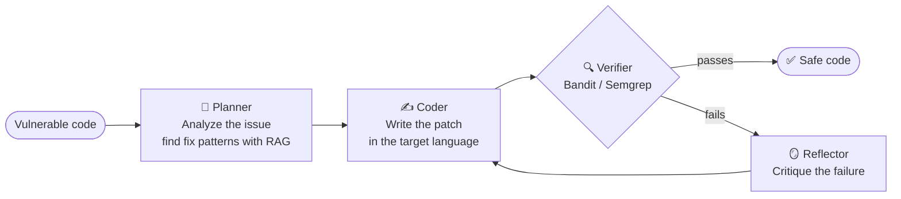

<div align="center">


# 🛡️ Project Sentinel

### The autonomous security engineer for your codebase.

Most scanners hand you a list of problems and wish you luck.<br />
Sentinel finds the vulnerability, writes the fix, and **proves it works** before touching your code.

<br />

[](https://pypi.org/project/sentinel-sec/)


[**Quick Start**](#-quick-start) · [**How It Works**](#-how-it-works) · [**Languages**](#-supported-languages) · [**Commands**](#-cli-commands) · [**Contribute**](#-contributing)

<br />


</div>

<br />

## 📖 Table of Contents

- [What is Sentinel](#-what-is-sentinel)
- [Quick Start](#-quick-start)
- [Choose Your AI Backend](#-choose-your-ai-backend)
- [How It Works](#-how-it-works)
- [Supported Languages](#-supported-languages)
- [Usage Examples](#-usage-examples)
- [CLI Commands](#-cli-commands)
- [Installation Options](#-installation-options)
- [Contributing](#-contributing)
- [License](#-license)

<br />

## 🧠 What is Sentinel

Sentinel is an AI-powered security agent. It reads your code, spots the vulnerability, and writes a patch. Then, instead of just trusting the AI, it **checks its own work** with a real static analysis tool. If the fix doesn't pass, it reads the failure, thinks again, and retries until the problem is actually gone.

That combination is the idea behind it: a language model for creativity, and **neuro-symbolic verification** (Bandit and Semgrep) for ground truth.

| | Typical scanner | Plain AI assistant | **Sentinel** |
|:--|:--:|:--:|:--:|
| Finds vulnerabilities | ✅ | ⚠️ | ✅ |
| Writes the fix | ❌ | ✅ | ✅ |
| Verifies the fix with SAST | ❌ | ❌ | ✅ |
| Self-corrects when the fix fails | ❌ | ❌ | ✅ |
| Runs fully offline | ✅ | ❌ | ✅ *(with Ollama)* |

<br />

## 🚀 Quick Start

**1. Install**

```bash
pip install sentinel-sec
```

**2. Pick an AI backend** (details [below](#-choose-your-ai-backend)), or just run the guided setup:

```bash
sentinel setup
```

**3. Fix something**

```bash
sentinel fix src/main.cpp      # preview the fix
sentinel apply services/auth.js  # fix it and write to the file
```

That's it. Sentinel auto-detects the language and picks the right verifier.

<br />

## 🔌 Choose Your AI Backend

<table>
<tr>
<td width="50%" valign="top">

### 🏠 Ollama &nbsp; `FREE · OFFLINE`
⭐ **Recommended**

Runs entirely on your machine. No API keys, no internet, and your code never leaves your laptop.

1. Install Ollama from [ollama.ai/download](https://ollama.ai/download)
2. Pull the model:
   ```bash
   ollama pull llama3
   ```
3. Keep it running in the background:
   ```bash
   ollama serve
   ```
4. Run Sentinel. It **auto-detects** Ollama.

</td>
<td width="50%" valign="top">

### ⚡ Groq &nbsp; `FAST · ONLINE`

Cloud inference that's very quick.

1. Get a free API key at [console.groq.com/keys](https://console.groq.com/keys) (it starts with `gsk_`)
2. Set it as an environment variable:

   **Linux / macOS**
   ```bash
   export GROQ_API_KEY="gsk_your_key_here"
   ```
   **Windows (PowerShell)**
   ```powershell
   $env:GROQ_API_KEY="gsk_your_key_here"
   ```
3. Run Sentinel.

</td>
</tr>
</table>

<br />

## ⚙️ How It Works

Sentinel runs a four-stage loop, and it only stops when the vulnerability is really gone.



| Stage | What it does |
|:------|:-------------|
| 🧭 **Planner** | Analyzes the code and the vulnerability, and uses RAG to find known fix patterns. |
| ✍️ **Coder** | Writes the patch in the target language (Python, C++, JS, and more). |
| 🔍 **Verifier** | Runs static analysis (Bandit or Semgrep) to confirm the fix is actually safe. |
| 🪞 **Reflector** | If verification fails, writes feedback so the Coder can correct itself and try again. |

<br />

## 🌍 Supported Languages

*New in v0.2.1:* Sentinel now auto-fixes vulnerabilities in seven languages.

| Language | Files | Verified by |
|:---------|:------|:------------|
| 🐍 Python | `.py` | Bandit |
| 🟨 JavaScript | `.js` | Semgrep |
| 🔷 TypeScript | `.ts` | Semgrep |
| ☕ Java | `.java` | Semgrep |
| ⚙️ C / C++ | `.c`, `.cpp` | Semgrep |
| 🐹 Go | `.go` | Semgrep |
| 🗄️ SQL | `.sql` | Semgrep |

The commands are the same for every language:

```bash
sentinel fix src/main.cpp
sentinel apply services/auth.js
```

<br />

## 💻 Usage Examples

```bash
# Python: SQL injection
sentinel apply auth.py

# JavaScript: XSS
sentinel apply frontend/input.js

# C++: buffer overflow (preview first)
sentinel fix src/buffer_test.cpp
```

**Illustrative example:** a SQL injection fix in Python

```diff
- query = f"SELECT * FROM users WHERE name = '{username}'"
- cursor.execute(query)
+ cursor.execute("SELECT * FROM users WHERE name = ?", (username,))
```

> 💡 **Tip:** start with `sentinel fix` to preview the change. Once you're happy, use `sentinel apply` to write it to the file.

<br />

## 🛠️ CLI Commands

| Command | What it does |
|:--------|:-------------|
| `sentinel setup` | Interactive setup guide |
| `sentinel fix <file>` | Analyze and show the fix (**preview only**) |
| `sentinel apply <file>` | Analyze, fix, and **write to the file** |
| `sentinel ui` | Launch the web dashboard |
| `sentinel version` | Show version info |

<br />

## 📦 Installation Options

**From PyPI** *(recommended)*

```bash
pip install sentinel-sec
```

**From GitHub** *(for development)*

```bash
git clone https://github.com/VaibhavBhagat665/sentinel-sec.git
cd sentinel-sec
pip install -e .
```

<br />

## 🤝 Contributing

Contributions are very welcome.

1. Fork the repo
2. Create a feature branch: `git checkout -b feature/amazing-feature`
3. Commit your changes: `git commit -m "Add amazing feature"`
4. Push the branch: `git push origin feature/amazing-feature`
5. Open a Pull Request

Found a bug or want a new language supported? [Open an issue](../../issues).

<br />

## 📄 License

Released under the [MIT License](LICENSE).

<br />

<div align="center">

**If Sentinel saved you from shipping a vulnerability, drop a ⭐ on the repo.**

Made with ❤️ by a mad man

</div>
